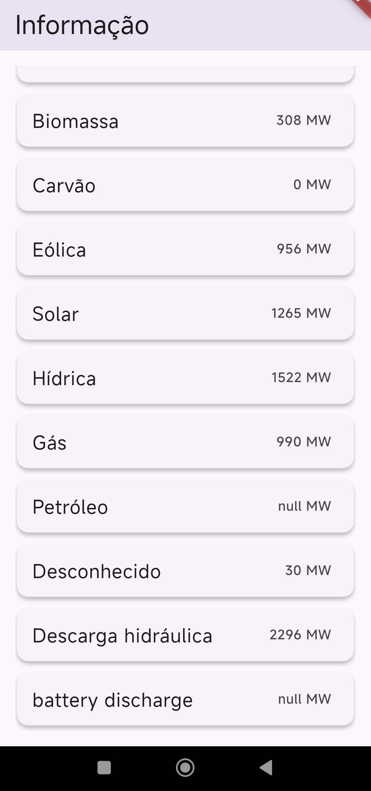
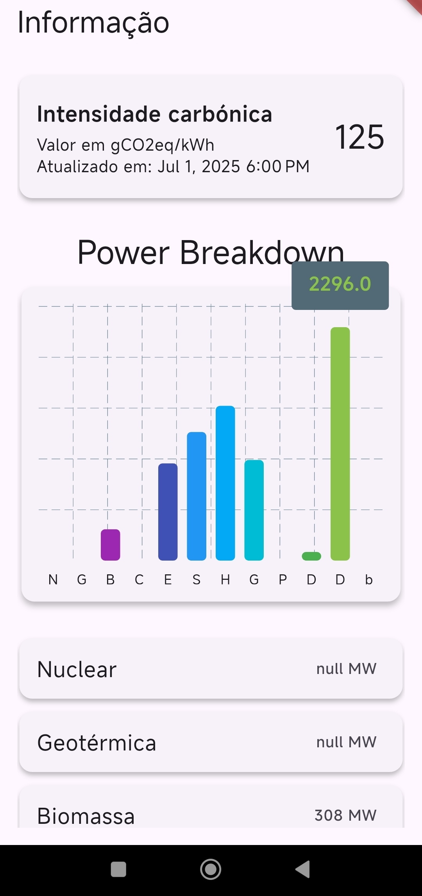

# Electricity

A Flutter app that displays real-time electricity carbon intensity and power production breakdown for Portugal, using the [Electricity Maps API](https://portal.electricitymaps.com/docs/api).

## Features

- Shows current carbon intensity (gCO2eq/kWh) for Portugal
- Displays a breakdown of power production by source (e.g., solar, wind, hydro)
- Visualizes the power breakdown with a vertical bar chart
- All power source names are translated to Portuguese
- Modern, material-inspired UI with cards and elevation
- Fully scrollable screen for a smooth experience

## Screenshots




## Getting Started

1. **Clone the repository:**
   ```sh
   git clone <your-repo-url>
   cd electricity
   ```
2. **Install dependencies:**
   ```sh
   flutter pub get
   ```
3. **Run the app:**
   ```sh
   flutter run
   ```

## API Key

This app uses the Electricity Maps API. The API key is set in the code for demonstration purposes. For production use, get your own API key from [Electricity Maps](https://portal.electricitymaps.com/) and update the `_apiKey` variable in `lib/main.dart`.

## Resources
- [Electricity Maps API Documentation](https://portal.electricitymaps.com/docs/api)
- [Flutter Documentation](https://docs.flutter.dev/)

---
